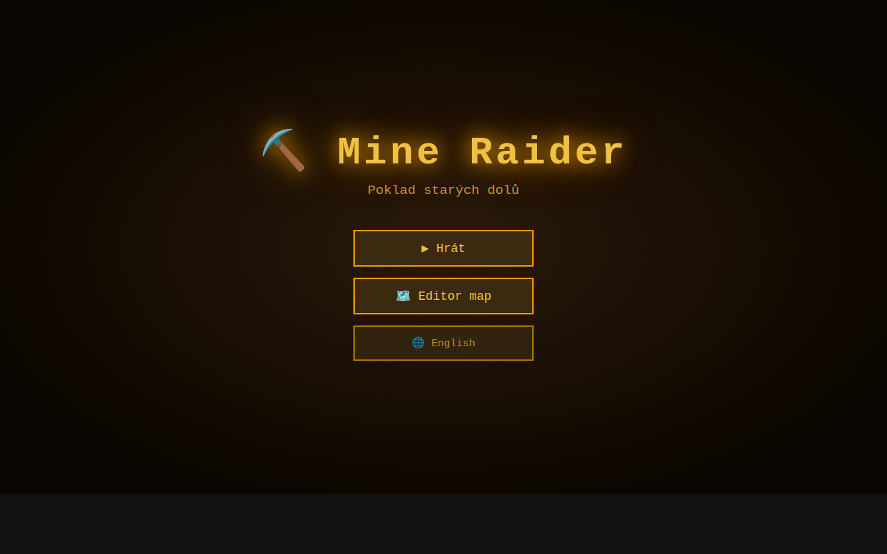
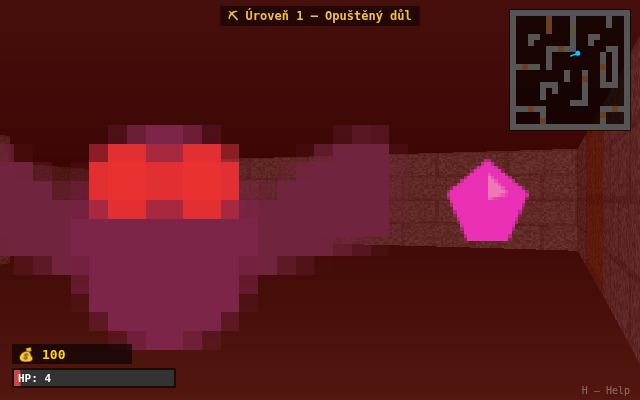

# ⛏️ Mine Raider – Treasure of the Old Mines

> A Wolfenstein 3D-style raycasting game built entirely in **vanilla JavaScript** and **HTML5 Canvas** — no game engine, no bundler, no image or audio assets required.



---

## 🎮 About

Mine Raider drops you into a series of abandoned mine shafts filled with traps, monsters, and hidden treasure. Navigate dark corridors, smash through wooden barriers with your pickaxe, collect gold and gems, and find the exit before the monsters find you.

Everything — wall textures, sprites, sounds — is **procedurally generated at runtime** using the Canvas 2D API and Web Audio API.

---

## ✨ Features

| Category | Details |
|---|---|
| **Rendering** | DDA raycasting engine (Wolf3D-style), textured walls, distance fog, floor/ceiling gradients |
| **Wall types** | Stone, Wood *(breakable)*, Ore, Mossy Stone, Crystal, Iron |
| **Enemies** | Bat, Spider, Skeleton, Ghost *(phases through walls!)* |
| **Collectibles** | Gold coins (100 pts), Gemstones (500 pts), Health packs |
| **Decorations** | Torches (ambient), Stone pillars (block movement, transparent sprite) |
| **Campaign** | 5 hand-crafted levels of increasing size and difficulty |
| **Difficulty** | Miner / Prospector / Deep Delver — scales enemy HP, speed, damage and attack rate |
| **Sprint** | Hold `Shift` to move 1.6× faster; stamina bar in HUD drains and regenerates |
| **Map editor** | Grid-based editor with full palette, level selector, resize, save/load |
| **i18n** | Czech 🇨🇿 / English 🇬🇧 UI language switch (persisted in localStorage) |
| **Audio** | Web Audio oscillator-based SFX — no audio files needed |
| **HUD** | Health bar, stamina bar, score, minimap with toggle, level name + difficulty badge |
| **Help overlay** | In-game help screen (press `H`) |

---

## 🚀 Getting Started

### Prerequisites
- **Node.js** v18 or newer
- A modern browser (Chrome, Firefox, Edge)

### Install & Run

```bash
git clone <repo-url>
cd action-game
npm install
npm start
```

Then open **http://localhost:3000** in your browser.

For development with automatic server restart on file changes:

```bash
npm run dev
```

---

## 🕹️ Controls

| Key | Action |
|---|---|
| `W A S D` / Arrow keys | Move |
| `Shift` | Sprint (1.6× speed, drains stamina) |
| Mouse | Look around (click canvas to lock pointer) |
| `Space` | Swing pickaxe — attack enemies, break wood walls |
| `M` | Toggle minimap |
| `H` | Toggle help overlay |
| `Q` / `E` | Rotate left / right (keyboard alternative) |
| `ESC` | Return to main menu |

---

## 🏔️ Campaign Levels

| # | Name | Size | New elements |
|---|---|---|---|
| 1 | Abandoned Mine | 20×20 | Basics – bats, gold, wood beams |
| 2 | Overgrown Shafts | 24×24 | Mossy stone walls, spiders |
| 3 | Crystal Caves | 24×24 | Crystal & iron walls, ghosts |
| 4 | Deep Tunnels | 28×28 | All wall types, mixed enemies |
| 5 | Cursed Depths | 30×30 | Maximum difficulty, all enemy types |

Score and HP carry over between levels. Find the **green exit door 🚪** to advance.

---

## ⛏️ Breakable Walls

**Wooden walls** (brown beam texture) can be destroyed with 3 pickaxe hits:

1. Face the wall from close range
2. Press `Space` three times
3. The wall darkens with each hit, then disappears — opening a new path

This mechanic unlocks hidden areas and shortcuts in every level.

---

## 👻 Enemy Types

| Enemy | HP | Speed | Damage | Score | Special |
|---|---|---|---|---|---|
| 🦇 Bat | 2 | Normal | Medium | 50 | — |
| 🕷️ Spider | 2 | **Fast** | Low | 100 | — |
| 💀 Skeleton | 3 | Slow | High | 200 | — |
| 👻 Ghost | 4 | Slow | **Very high** | 300 | Phases through walls |

All enemies patrol randomly until they spot you (line-of-sight check). Ghosts always track you regardless of walls.

---

## 🗺️ Map Editor

Click **Map Editor** from the main menu to open the grid editor.

**Palette** (left panel):
- Click a tile type to select it
- Left-click on the grid to paint
- Right-click to erase

**Level selector dropdown** — load any of the 5 campaign levels as a starting point, then customise and save.

**Validation** — the editor checks for a player start `🧑` and at least one exit `🚪` before letting you play.

**Saving** — maps are stored in browser `localStorage`. Use **💾 Save** before switching levels.

### Placing Pillars
Stone pillars `🪨` are placed like any entity. They:
- Block player movement (push-back collision)
- Render as a tall transparent-edged stone column sprite
- Do not block raycasting (enemies and lines of sight pass through)

---

## 📁 Project Structure

```
action-game/
├── server.js            ← Express static server
├── index.html           ← Single HTML entry point
├── css/
│   └── style.css        ← All UI styles
├── docs/
│   └── screenshot.png   ← Menu screenshot
└── js/
    ├── main.js          ← Game loop, state machine, level progression
    ├── config.js        ← All constants, tile type enum, wall sets
    ├── i18n.js          ← Czech / English translations
    ├── map.js           ← 5 built-in campaign levels, save/load, entity extraction
    ├── raycaster.js     ← DDA raycasting engine
    ├── renderer.js      ← Frame orchestration (ceiling, floor, walls, sprites, HUD)
    ├── textures.js      ← Procedural wall textures + billboard sprites
    ├── sprites.js       ← Sprite sorting, depth clipping, billboard rendering
    ├── entities.js      ← Player, Enemy, Treasure, Pillar, Exit, Torch, HealthPack
    ├── collision.js     ← AABB grid collision with wall sliding
    ├── input.js         ← Keyboard state + pointer-lock mouse delta
    ├── hud.js           ← Health bar, score, minimap, level name, help overlay
    ├── audio.js         ← Web Audio oscillator SFX (no audio files)
    └── editor.js        ← Grid map editor, palette, level selector
```

---

## 🛠️ Technical Notes

- **No build step** — pure ES modules served as-is via Express (correct MIME types for `import`)
- **No external dependencies** at runtime — only `express` for the dev server
- **Textures** are generated once into `<canvas>` elements and cached; wall columns are drawn with `drawImage` 1px slice technique
- **Sprite rendering** uses painter's algorithm (sorted by distance), depth-buffer clipped against the wall depth buffer
- **Breakable walls** track remaining HP in a `Map` keyed by tile coordinates; damage is visualised as a darkening overlay on each wall column
- **Ghost enemy** skips collision checks and always has line-of-sight, making it the most dangerous enemy type

---

## 📸 Adding an In-Game Screenshot

The `docs/screenshot.png` currently shows the main menu. To replace it with an in-game shot:

1. Start the game (`npm start`)
2. Open http://localhost:3000, play to a nice view
3. Press `F12` → Console → `document.getElementById('game-canvas').toBlob(b => { const a = document.createElement('a'); a.href = URL.createObjectURL(b); a.download='screenshot.png'; a.click() })`
4. Replace `docs/screenshot.png` with the downloaded file



---

## 📄 License

MIT — do whatever you want with it.
